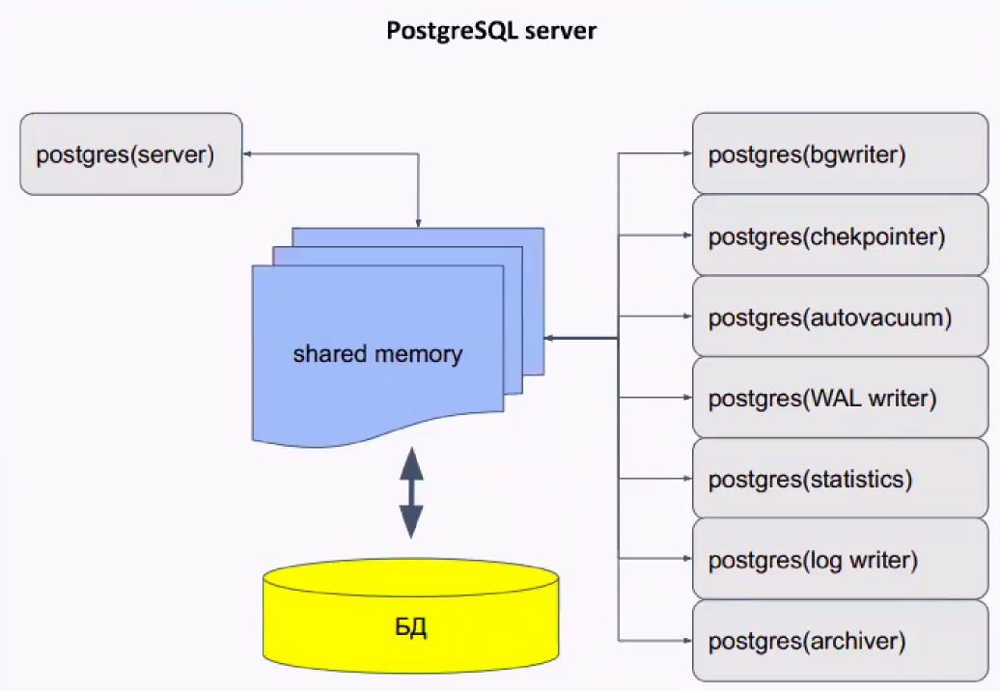

# Цель домашнего задания
Научиться настраивать репликацию и создавать резервные копии в СУБД PostgreSQL

<pre>
Описание домашнего задания
1) Настроить hot_standby репликацию с использованием слотов
2) Настроить правильное резервное копирование

</pre>

## Введение
<pre>
PostgreSQL — свободная объектно-реляционная система управления базами данных (СУБД). 
Основные термины в Postgres:
Кластер - объединение нескольких баз данных. В postgres это означает что на одном хосте создаётся несколько баз сразу. 
База данных - физическое объединение объектов
Схема - логическое объединение таблиц в базе данных. По умолчанию в postgres создаётся одна схема под названием Public
По умолчанию в кластере находятся:
- template0 - read only БД, содержащая инициализационный набор данных
- template1 - база-шаблон для создания новых баз
- postgres (при желании можно поменять название). В базе находятся служебные таблицы, можно также использовать данную базу для своих нужд, но это не рекомендуется.

Управлять базами, таблицами и данными можно не только с помощью консольной утилиты psql, но и с помощью GUI-утилит, например pgAdmin, Dbeaver  и т. д.

Postgres - это мультироцессное приложение. Состоит из главного процесса (postgres), который отвечает за подключение клиентов, взаимодействие с кэшом и отвечает за остальные процессы (background processes).

</pre>

<pre>
Основные конфигурационные файлы в Postgres: 
●	pg_hba.conf -  файл задаёт способ доступа к базам и репликации из различных источников.
●	postgresql.conf - файл конфигурации, обычно находится в каталоге данных, может редактироваться вручную. Может быть несколько значений одного и того же параметра, тогда вступает в силу последнее значение.
●	postgresql.auto.conf - предназначен для автоматического изменения параметров postgres

WAL (Write Ahead Log) - журнал упреждающей записи
В WAL записывается информация, достаточная для повторного выполнения всех действий с БД.
Записи этого журнала обязаны попасть на диск раньше, чем изменения в соответствующей странице. Журнал состоит из нескольких файлов (обычно по 16МБ), которые циклически перезаписываются.

Репликация - процесс синхронизации нескольких копий одного объекта. Решает задачу отказоустойчивости и масштабируемости.

Задачи репликации:
●	балансировка нагрузки
●	резервирование (НЕ БЭКАП, бэкап можно делать с реплики)
●	обновление без остановки системы
●	горизонтальное масштабирование
●	геораспределение нагрузки

Виды репликации:
●	Физическая репликация - описание изменений на уровне файлов. Побайтовая копия данных.
●	Логическая репликация - изменения данных в терминах строк таблиц. Более высокий уровень, чем файлы

Помимо репликации, рекомендуется создавать резервные копии. Они могут потребоваться, если вдруг сервера СУБД выйдут из строя. 

</pre>

# Решение:

## 1. Работа со стендом и настройка DNS

Данный Vagrantfile развернёт 3 виртаульные машины ОС CentOS 8 Stream. Каждая ВМ будет иметь по 4ГБ ОЗУ и по два ядра CPU. 

## 1) Проверка настройки hot_standby репликации с использованием слотов
<pre>

Проверка репликации: 
На хосте node1 в psql создадим базу otus_test и выведем список БД: 
postgres=# CREATE DATABASE otus_test;
CREATE DATABASE
postgres=# \l
                                  List of databases
   Name    |  Owner   | Encoding |   Collate   |    Ctype    |   Access privileges   
-----------+----------+----------+-------------+-------------+-----------------------
 otus      | postgres | UTF8     | en_US.UTF-8 | en_US.UTF-8 | 
 otus_test | postgres | UTF8     | en_US.UTF-8 | en_US.UTF-8 | 
 postgres  | postgres | UTF8     | en_US.UTF-8 | en_US.UTF-8 | 
 template0 | postgres | UTF8     | en_US.UTF-8 | en_US.UTF-8 | =c/postgres          +
           |          |          |             |             | postgres=CTc/postgres
 template1 | postgres | UTF8     | en_US.UTF-8 | en_US.UTF-8 | =c/postgres          +
           |          |          |             |             | postgres=CTc/postgres
(5 rows)

postgres=# 

На хосте node2 также в psql также проверим список БД (команда \l), в списке БД должна появится БД otus_test. 

[vagrant@node2 ~]$ sudo -i
[root@node2 ~]# su postgres
bash-4.4$ psql
could not change directory to "/root": Permission denied
psql (14.11)
Type "help" for help.

postgres=# \l
                                  List of databases
   Name    |  Owner   | Encoding |   Collate   |    Ctype    |   Access privileges   
-----------+----------+----------+-------------+-------------+-----------------------
 otus      | postgres | UTF8     | en_US.UTF-8 | en_US.UTF-8 | 
 otus_test | postgres | UTF8     | en_US.UTF-8 | en_US.UTF-8 | 
 postgres  | postgres | UTF8     | en_US.UTF-8 | en_US.UTF-8 | 
 template0 | postgres | UTF8     | en_US.UTF-8 | en_US.UTF-8 | =c/postgres          +
           |          |          |             |             | postgres=CTc/postgres
 template1 | postgres | UTF8     | en_US.UTF-8 | en_US.UTF-8 | =c/postgres          +
           |          |          |             |             | postgres=CTc/postgres
(5 rows)

postgres=#

Также можно проверить репликацию другим способом: 
На хосте node1 в psql вводим команду: select * from pg_stat_replication;

postgres=# select * from pg_stat_replication;
 pid  | usesysid |   usename   |  application_name  |  client_addr  | client_hostname | client_port |         backend_start    
     | backend_xmin |   state   | sent_lsn  | write_lsn | flush_lsn | replay_lsn |    write_lag    |    flush_lag    |   replay
_lag    | sync_priority | sync_state |          reply_time           
------+----------+-------------+--------------------+---------------+-----------------+-------------+--------------------------
-----+--------------+-----------+-----------+-----------+-----------+------------+-----------------+-----------------+---------
--------+---------------+------------+-------------------------------
 9860 |    16384 | replication | walreceiver        | 192.168.57.12 |                 |       56578 | 2024-04-26 05:29:53.64413
1-03 |          739 | streaming | 0/3019AE8 | 0/3019AE8 | 0/3019AE8 | 0/3019AE8  |                 |                 |         
        |             0 | async      | 2024-04-26 05:38:38.741444-03
 9863 |    16385 | barman      | barman_receive_wal | 192.168.57.13 |                 |       58864 | 2024-04-26 05:30:02.38049
-03  |              | streaming | 0/3019AE8 | 0/3019AE8 | 0/3000000 |            | 00:00:05.487159 | 00:08:31.577669 | 00:08:31
.577669 |             0 | async      | 2024-04-26 05:38:33.969988-03
(2 rows)

На хосте node2 в psql вводим команду: select * from pg_stat_wal_receiver;

postgres=# select * from pg_stat_wal_receiver;
 pid  |  status   | receive_start_lsn | receive_start_tli | written_lsn | flushed_lsn | received_tli |      last_msg_send_time 
     |     last_msg_receipt_time     | latest_end_lsn |        latest_end_time        | slot_name |  sender_host  | sender_port
 |                                                                                                                             
            conninfo                                                                                                           
                              
------+-----------+-------------------+-------------------+-------------+-------------+--------------+-------------------------
-----+-------------------------------+----------------+-------------------------------+-----------+---------------+------------
-+-----------------------------------------------------------------------------------------------------------------------------
-------------------------------------------------------------------------------------------------------------------------------
------------------------------
 9232 | streaming | 0/3000000         |                 1 | 0/3019BD0   | 0/3019BD0   |            1 | 2024-04-26 05:39:32.8318
6-03 | 2024-04-26 05:39:32.833923-03 | 0/3019BD0      | 2024-04-26 05:39:02.753573-03 |           | 192.168.57.11 |        5432
 | user=replication password=******** channel_binding=prefer dbname=replication host=192.168.57.11 port=5432 fallback_applicati
on_name=walreceiver sslmode=prefer sslcompression=0 sslsni=1 ssl_min_protocol_version=TLSv1.2 gssencmode=prefer krbsrvname=post
gres target_session_attrs=any
(1 row)

</pre>

## 2) Проверка резервного копирования

<pre>
Теперь проверим работу barman: 
[root@barman ~]# su basman
su: user basman does not exist
[root@barman ~]# su barman
bash-4.4$ barman switch-wal node1
The WAL file 000000010000000000000003 has been closed on server 'node1'
bash-4.4$ barman cron 
Starting WAL archiving for server node1
bash-4.4$ barman check node1
Server node1:
	PostgreSQL: OK
	superuser or standard user with backup privileges: OK
	PostgreSQL streaming: OK
	wal_level: OK
	replication slot: OK
	directories: OK
	retention policy settings: OK
	backup maximum age: FAILED (interval provided: 4 days, latest backup age: No available backups)
	backup minimum size: OK (0 B)
	wal maximum age: OK (no last_wal_maximum_age provided)
	wal size: OK (0 B)
	compression settings: OK
	failed backups: OK (there are 0 failed backups)
	minimum redundancy requirements: FAILED (have 0 backups, expected at least 1)
	pg_basebackup: OK
	pg_basebackup compatible: OK
	pg_basebackup supports tablespaces mapping: OK
	systemid coherence: OK (no system Id stored on disk)
	pg_receivexlog: OK
	pg_receivexlog compatible: OK
	receive-wal running: OK
	archiver errors: OK
bash-4.4$ 

После этого запускаем резервную копию: 

bash-4.4$ barman backup node1
Starting backup using postgres method for server node1 in /var/lib/barman/node1/base/20240426T084536
Backup start at LSN: 0/4000060 (000000010000000000000004, 00000060)
Starting backup copy via pg_basebackup for 20240426T084536
Copy done (time: 1 second)
Finalising the backup.
This is the first backup for server node1
WAL segments preceding the current backup have been found:
	000000010000000000000003 from server node1 has been removed
Backup size: 41.8 MiB
Backup end at LSN: 0/6000000 (000000010000000000000005, 00000000)
Backup completed (start time: 2024-04-26 08:45:36.642005, elapsed time: 1 second)
Processing xlog segments from streaming for node1
	000000010000000000000004
	000000010000000000000005
bash-4.4$ 

</pre>

## Проверка восстановления из бекапов:

### На хосте node1 в psql удаляем базы Otus и Otus_test: 

<pre>
postgres=# \l
                                  List of databases
   Name    |  Owner   | Encoding |   Collate   |    Ctype    |   Access privileges   
-----------+----------+----------+-------------+-------------+-----------------------
 otus      | postgres | UTF8     | en_US.UTF-8 | en_US.UTF-8 | 
 otus_test | postgres | UTF8     | en_US.UTF-8 | en_US.UTF-8 | 
 postgres  | postgres | UTF8     | en_US.UTF-8 | en_US.UTF-8 | 
 template0 | postgres | UTF8     | en_US.UTF-8 | en_US.UTF-8 | =c/postgres          +
           |          |          |             |             | postgres=CTc/postgres
 template1 | postgres | UTF8     | en_US.UTF-8 | en_US.UTF-8 | =c/postgres          +
           |          |          |             |             | postgres=CTc/postgres
(5 rows)

postgres=# DROP DATABASE otus;
DROP DATABASE
postgres=# DROP DATABASE otus_test; 
DROP DATABASE
postgres=# \l
                                  List of databases
   Name    |  Owner   | Encoding |   Collate   |    Ctype    |   Access privileges   
-----------+----------+----------+-------------+-------------+-----------------------
 postgres  | postgres | UTF8     | en_US.UTF-8 | en_US.UTF-8 | 
 template0 | postgres | UTF8     | en_US.UTF-8 | en_US.UTF-8 | =c/postgres          +
           |          |          |             |             | postgres=CTc/postgres
 template1 | postgres | UTF8     | en_US.UTF-8 | en_US.UTF-8 | =c/postgres          +
           |          |          |             |             | postgres=CTc/postgres
(3 rows)

postgres=# 

</pre>

### Далее на хосте barman запустим восстановление: 

<pre>
bash-4.4$ barman list-backup node1
node1 20240426T084536 - Fri Apr 26 05:45:37 2024 - Size: 41.8 MiB - WAL Size: 0 B

bash-4.4$ barman recover node1 20240426T084536 /var/lib/pgsql/14/data/ --remote-ssh-comman "ssh postgres@192.168.57.11"
The authenticity of host '192.168.57.11 (192.168.57.11)' can't be established.
RSA key fingerprint is SHA256:a5A+w+IGgodopcAsDZjoJ3Snww/XzGjBCM7q+tMFJjs.
Are you sure you want to continue connecting (yes/no/[fingerprint])? yes
Starting remote restore for server node1 using backup 20240426T084536
Destination directory: /var/lib/pgsql/14/data/
Remote command: ssh postgres@192.168.57.11
Copying the base backup.
Copying required WAL segments.
Generating archive status files
Identify dangerous settings in destination directory.

Recovery completed (start time: 2024-04-26 08:51:32.979354+00:00, elapsed time: 3 seconds)
Your PostgreSQL server has been successfully prepared for recovery!
bash-4.4$ 

</pre>

Далее на хосте node1 потребуется перезапустить postgresql-сервер и снова проверить список БД. Базы otus вернулись обратно. 
<pre>
[root@node1 ~]# systemctl restart postgresql-14.service 
[root@node1 ~]# su postgres
bash-4.4$ psql
could not change directory to "/root": Permission denied
psql (14.11)
Type "help" for help.

postgres=# \l
                                  List of databases
   Name    |  Owner   | Encoding |   Collate   |    Ctype    |   Access privileges   
-----------+----------+----------+-------------+-------------+-----------------------
 otus      | postgres | UTF8     | en_US.UTF-8 | en_US.UTF-8 | 
 otus_test | postgres | UTF8     | en_US.UTF-8 | en_US.UTF-8 | 
 postgres  | postgres | UTF8     | en_US.UTF-8 | en_US.UTF-8 | 
 template0 | postgres | UTF8     | en_US.UTF-8 | en_US.UTF-8 | =c/postgres          +
           |          |          |             |             | postgres=CTc/postgres
 template1 | postgres | UTF8     | en_US.UTF-8 | en_US.UTF-8 | =c/postgres          +
           |          |          |             |             | postgres=CTc/postgres
(5 rows)

postgres=# 
</pre>

